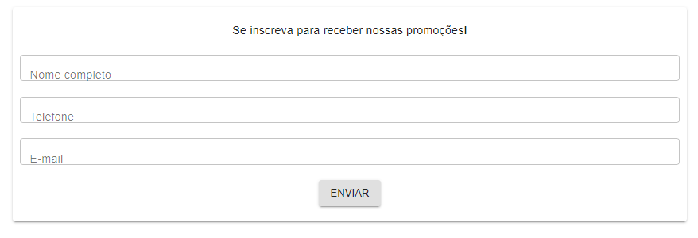

<h1 align="center">

</h1>

<h3 align="center">
  Formulário de cadastro de lead   Hiring Coders 2021    Grupo 25
</h3>

  <a href="#introdução">Introdução</a>&nbsp;&nbsp;&nbsp;|&nbsp;&nbsp;&nbsp;
  <a href="#-sobre-o-desafio">Sobre o desafio</a>&nbsp;&nbsp;&nbsp;|&nbsp;&nbsp;&nbsp;
  <a href="#-tecnologias">Tecnologias</a>

## Introdução

Este bloco customizado deve ser utilizado no sistema do VTEX IO para coletar dados de leads e salvá-los em uma tabela de leads.

</img>

## 👨🏻‍💻 Sobre o desafio

- 
Desenvolver um projeto com o uso de API, sendo que os grupos serão divididos em 3 apresentações (em datas diferentes para bancas diferentes)!
- O projeto deverá ser o mesmo para os 3 grupos, o que muda é a temática da API que eles vão puxar, que deve estar relacionada com o mercado de cada patrocinador!! Sendo eles:
  - [AWS](https://aws.amazon.com/pt/) 
  - [ACCT](https://acct.global) 
  - [Corebiz](https://www.corebiz.ag/pt/)
  

### Repositório do projeto
https://github.com/victorhgadioli/hiringcoders2021-finalChallenge-main

### 💻 Desenvolvedores
- [André Moraes](https://github.com/andreLTMoraes)
- [Anna Laura](https://github.com/alauraivani)
- [Cristiano Souza Santana](https://github.com/CristianoSantan)
- [Fabiano Pereira](https://github.com/ifabianoi)
- [Maria (Marrô) Rosa Müller ](https://github.com/Marro-Muller)
- [Otávio Cleyderman Ferraz Faria](https://github.com/OtavioCleyderman)
- [Pedro Laranjeira](https://github.com/pedroasso)
- [Reginaldo Oliveira](https://github.com/Reginaldo007oliveira)
- [Victor Martins](https://github.com/VictorFerreiraMartins)
- [Victor Hugo Gadioli](https://github.com/victorhgadioli)

## 🚀 Tecnologias

Tecnologias que utilizamos para desenvolver esta API Rest:

- [Styled Components](https://styled-components.com/)
- [Material UI](https://material-ui.com/pt/)
- [React](https://pt-br.reactjs.org/)
- [VTEX IO](https://vtex.io/)
- [GraphQL](https://graphql.org/)
